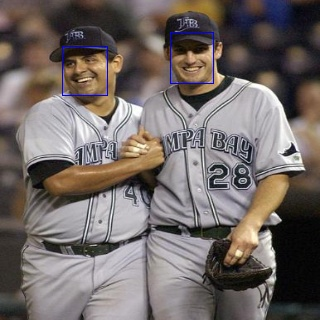
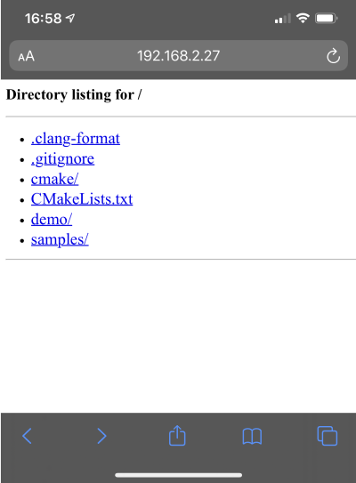

[<< Return to Overview](README.md)

[STEP 1](step1.md) | **STEP 2** | [STEP 3](step3.md)

# Step 2

1. Setup Vitis AI and run example applications with minimal dependencies
2. **Add Vitis AI Library & Model Zoo and run dependent sample applications**
3. Build and run more comprehensive demonstration code
---

This step will cover installing the Vitis AI Library and Model Zoo on the targeted evaluation board.  It assumes you've already setup the board and SD card as provided in Step 1.  It will also cover running some simple demos that utilize the installed library and models.

Using the same diagram as in Step 1, the focus of this step is indicated below.

| Application |
|:---:|
|--> ***Vitis AI Library: Model Libs (API1/API2)*** <--
|Vitis AI Library: Base Libs
|Vitis AI Runtime (VART): Unified API (API_0)
|Vitis AI Runtime (VART): Implementation API / Core Libs
|XRT (Xilinx RunTime)

he Vitis AI Library provides two types of examples:
  - **samples:** These examples provide a suite of simple  tests for each type of model (e.g. classification, segmentation, facedetect, etc.) in the folder.  That is, for each model there's an application that: works with an image, works with video input, tests performance, and tests accuracy. Note that some of these examples rely on pre-built binaries so although the code allows for quick benchmarking it is not necessarily re-useable as reference code for your own application.
  - **demo:** These examples rely strictly on Vitis AI Library APIs so all the source code here can be re-used as reference code.  They cover a range of API levels from API0 all the way up to API2, in addition to some multi-task demos.

For a quick validation of our setup (i.e. correct use of installed packages) a 'sample' example is more fitting and therefore covered in this step.  The 'demo' examples will be exercised in the final step (Step 3) of this tutorial.

| Note: |
|:---|
|This step provides a more comprehensive walk-through of a similar procedure given here: [Xilinx@GitHub / Vitis-AI / Vitis-AI-Library / README.md > Quick Start](https://github.com/Xilinx/Vitis-AI/tree/f122072b2016f8dfa37d5d2cd0a82ca8a2f3f4ae/Vitis-AI-Library#quick-start)

## 2.1 Build and Transfer Examples

Similar to Step 1, we'll start by building the application source from the Vitis AI repository location.  Here we'll arbitrarily select the facedetect example.

```
$ cd <path-to-vitis-ai-repo>/Vitis-AI-Library/overview/samples/facedetect/
$ ./build.sh
```
The result should be 4 new executables:
 - test_accuracy_facedetect
 - test_jpeg_facedetect
 - test_performance_facedetect
 - test_performance_facedetect

Unlike in Step 1, where the SD card was used, this time a USB thumb drive (or similar) will be used to transfer files to the board because the BOOT partition on the SD card would be too small.  However, feel free to transfer the files using whatever alternative method you prefer (e.g. over the network or directly to the larger ROOTFS partition on the SD card).

For simplicity, copy the entire `overview` directory (i.e. `<path-to-vitis-ai-repo>/Vitis-AI-Library/overview`) over to the USB and then keep the drive plugged into the host so additional files can be transferred in a subsequent step.

## 2.2 Download & Install Additional Vitis AI Packages

To leverage the higher-level libs additional install packages will be needed for installation on the targeted board.

The Vitis AI Library & Model Zoo are provided as Linux *.deb packages, one of which was already included in an archive downloaded in Step 1 (vitis-ai-runtime-1.1.0.tar.gz).  Download the additional Model Zoo package using one of the following links:
 - Vitis AI Model Package for ZCU102: [https://www.xilinx.com/bin/public/openDownload?filename=vitis_ai_model_ZCU102_2019.2-r1.1.0.deb](https://www.xilinx.com/bin/public/openDownload?filename=vitis_ai_model_ZCU102_2019.2-r1.1.0.deb)
 - Vitis AI Model Package for ZCU104: [https://www.xilinx.com/bin/public/openDownload?filename=vitis_ai_model_ZCU104_2019.2-r1.1.0.deb](https://www.xilinx.com/bin/public/openDownload?filename=vitis_ai_model_ZCU104_2019.2-r1.1.0.deb)

While we're in the process of downloading, let's also download the additional images and videos that are provided for these higher-level applications:
 - Image Samples: [https://www.xilinx.com/bin/public/openDownload?filename=vitis_ai_library_r1.1_images.tar.gz](https://www.xilinx.com/bin/public/openDownload?filename=vitis_ai_library_r1.1_images.tar.gz)
 - Video Samples: [https://www.xilinx.com/bin/public/openDownload?filename=vitis_ai_library_r1.1_video.tar.gz](https://www.xilinx.com/bin/public/openDownload?filename=vitis_ai_library_r1.1_video.tar.gz)

Proceed with copying the downloaded files to the USB thumb drive and, if not already on, power up the board.  Once the copying is done and the board is running, plug the drive into the USB port of the board (use the supplied adapter in the case of the ZCU102).  We'll get to mounting it in a bit.  

Once again, we'll assume a ZCU102 board from here onwards but just swap out `ZCU102` for `ZCU104` as needed in the commands if you're using the other board.  

We'll start by installing Vitis AI Library package which should still be in your home directory (where it was extracted from Step 1).  This will install files to various locations in the system including /usr/bin, usr/include, /usr/lib, and /usr/share.
```
$ cd ~/vitis-ai-runtime-1.1.2/Vitis-AI-Library/aarch64/
$ dpkg -i libvitis_ai_library-1.1.0-Linux-build46.deb
```
Now mount the USB drive and install the Model Zoo.  Due to the number of models this can take sometime to complete.  The pre-compiled model zoo files will be installed to `/usr/share/vitis_ai_library/model`.
```
$ mount /dev/sda /media
$ cd /media/ # assuming files are at root of drive, otherwise use applicable path
$ dpkg -i vitis_ai_model_ZCU102_2019.2-r1.1.0.deb
```
Lastly, install the sample applications and image/video files.
```
$ cp -r overview/ ~/overview
$ cd ~/overview
$ tar -xaf /media/vitis_ai_library_r1.1_images.tar.gz
$ tar -xaf /media/vitis_ai_library_r1.1_video.tar.gz
```

## 2.3 Run Vitis AI Library Example

Time to run some code and see results!  Similar to Step 1, we'll walk through both an image and video example.

 ### 2.3.1 Run Sample Image Application

For information on how to run any of the 'sample' applications a `readme` file is provided in each sub-directory. We'll start with an image based example:
```
$ cd ~/overview/samples/facedetect/
$ cat readme
Important:
  ./test_jpeg_facedetect, ./test_performance_facedetect, ./test_video_facedetect the first param followed must be followed with model name.
  Valid model name:
    densebox_320_320
    densebox_640_360

1, compile

    execute the following command:

        sh build.sh

2, copy the compiled executable file and test image to the development board.

   run the executable file.

    sample : ./test_jpeg_facedetect densebox_320_320 sample_facedetect.jpg
    output :
WARNING: Logging before InitGoogleLogging() is written to STDERR
I1108 22:41:20.277091  5071 process_result.hpp:57]  1.00007 0.19375 0.14375 0.14375 0.15625
I1108 22:41:20.277343  5071 process_result.hpp:57]  1.00007 0.53125 0.1 0.1375 0.1625


    sample : ./test_jpeg_facedetect densebox_640_360 sample_facedetect.jpg
    output :
WARNING: Logging before InitGoogleLogging() is written to STDERR
I1108 22:41:20.460816  5078 process_result.hpp:57]  0.996612 0.535937 0.075 0.117188 0.194444

```
Based on the `readme` we can test out face detection on an image using the pre-compiled densebox_320_320 model follows:
```
$ ./test_jpeg_facedetect densebox_320_320 sample_facedetect.jpg
WARNING: Logging before InitGoogleLogging() is written to STDERR
I0330 03:37:50.826640  2778 process_result.hpp:25]  1.00007 0.19375 0.14375 0.14375 0.15625
I0330 03:37:50.830754  2778 process_result.hpp:25]  1.00007 0.53125 0.1 0.1375 0.1625
```
As seen in the `readme` the 'WARNING' is expected and can be safely ignored.  The result provides the probability of a face being detected (first number) and the coordinates of a bounding box for the detected face.  A new `sample_facedetect_result.jpg` is also created as shown below.



Similarly, the performance test would be run as follows:
```
$ ./test_performance_facedetect densebox_320_320 test_performance_facedetect.list
WARNING: Logging before InitGoogleLogging() is written to STDERR
I0330 03:44:50.891253  2813 benchmark.hpp:163] writing report to <STDOUT>
I0330 03:44:50.891613  2813 benchmark.hpp:183] waiting for 0/30 seconds, 1 threads running
I0330 03:45:00.891741  2813 benchmark.hpp:183] waiting for 10/30 seconds, 1 threads running
I0330 03:45:10.891922  2813 benchmark.hpp:183] waiting for 20/30 seconds, 1 threads running
I0330 03:45:20.892177  2813 benchmark.hpp:192] waiting for threads terminated
FPS=386.133
E2E_MEAN=2588.76
DPU_MEAN=1346.91

```
Images for this test are provided in the `images` folder.  By default the performance test runs for 30 seconds and uses 1 thread.  This can be adjusted as follows (8 threads & 60s):
```
$ ./test_performance_facedetect densebox_320_320 test_performance_facedetect.list -t 8 -s 60
WARNING: Logging before InitGoogleLogging() is written to STDERR
I0330 03:45:52.939249  2820 benchmark.hpp:163] writing report to <STDOUT>
I0330 03:45:52.973646  2820 benchmark.hpp:183] waiting for 0/60 seconds, 8 threads running
.
.
.
FPS=1441.82
E2E_MEAN=5560.01
DPU_MEAN=3924.53
```
As one would expect this increases the measured FPS.

| Note: |
|:---|
|All face detect examples above use densebox_320_320 over densebox_640_360 because the provided sample image (sample_facedetect.jpg) is 386x450 and scaling to 320x320 causes less distortion.  In fact, if you run the same example with densebox_640_360 the detection results will not be accurate for the sample image.

---
#### Bonus Section
This section will show you how Python can be used to view files on the board from your host machine, assuming the board is connected to you local network.
```
$ ifconfig eth0 up # connect to local network with DHCP
$ ifconfig # record IP address
$ cd ~/overview
$ python -m SimpleHTTPServer 8080
```
Now from the host use your favorite browser to connect to the board using its IP address and assigned port number.  For example, mine was http://192.168.2.27:8080 and this is what was served up:



Now you can just browse to any result images.

---

### 2.3.2 Run Sample Video Application

Now lets move on to a face detect video example.  Since no sample video clip is provided that's appropriate for face detection we'll use a clip that's openly available under the Creative Commons Attribution license: [sample_cafe.mp4](resources/sample_cafe.mp4)

| Note: |
|:---|
|The original video was clipped to a timeframe that included people in the foreground and increased to 60fps (from ~25fps).  This framerate was increased because the test application displays frames as fast as it processes them, which turns out to be >50fps in this case.  If the original framerate was used it would be difficult to see the results in the video because the playback is accelerated.  HandBrake was used to create the clip and the advanced search feature of YouTube was used to find CCA licensed videos only.

To run the test using the sample video clip first download the clip from the link above and transfer it to the board.  Alternatively, if you connect the board to your local network, you can download it directly to the board as given below.
```
$ export DISPLAY=:0.0 # Not needed for standalone board use
$ ifconfig eth0 up # connect to local network with DHCP
$ cd ~/overview/samples/facedetect/
$ wget -O sample_cafe.mp4 https://github.com/mkycrb/vitis-ai_tutorials/raw/master/3-step_quick-start/resources/sample_cafe.mp4
$ ./test_video_facedetect densebox_640_360 sample_cafe.mp4
```
The results are shown by displaying the original video with bounding boxes around detected faces.  Use <Ctrl+C> to exit the test at anytime.  The `densebox_640_360` model was selected because this matches the aspect ratio of the sample video clip.

Additional examples, including running the face detect application using video input from a USB webcam, can be found in the Vitis AI Libraries documentation: Vitis-AI@GitHub / Vitis-AI-Library / README.md > [Running Vitis AI Library Examples](https://github.com/Xilinx/Vitis-AI/tree/v1.0/Vitis-AI-Library#running-vitis-ai-library-examples)

### 2.3.3 Notes on Sample Applications

|Sample | Image Test | Video Test | Perf Test | Accuracy Test |
|---|---|---|---|---|
|classification|input image provided, output image generated (see readme)|no input video provided |test_perf\* \<model\> \<\*.list\> (see readme)|run w/o args for info|
|facedetect|input image provided, output image generated (see readme)|no input video provided (see [tutorial samples](resources/README.md)) |test_perf\* \<model\> \<*.list\> (see readme)|not working|
|facelandmark|input image provided, output image generated (see readme)|no input video provided|test_perf\* \<model\> \<*.list\> (see readme)|mkdir result; test_acc\* \<\*.list\> (see test_acc\*.cpp)|
|multitask|input image provided, output image generated (see readme)|use sample clip\*: demo / segs_and_roadline_detect / seg_512_288.avi|test_perf\* \<model\> \<*.list\> (see readme)|TBD|
|openpose|input image provided, output image generated (see readme)|use sample clip\*: demo / seg_and_pose_detect / pose_960_540.avi|test_perf\* \<model\> \<*.list\> (see readme)|TBD|
|posedetect|input image provided, output image generated (see readme)|no input video provided|test_perf\* \<model\> \<*.list\> (see readme)|-|
|refinedet|input image provided, output image generated (see readme)|no input video provided|test_perf\* \<model\> \<*.list\> (see readme)|TBD|
|reid|input images provided, results printed to terminal (see readme)|n/a|test_perf\* \<model\> \<*.list\> (see readme)|TBD|
|roadline|input image provided, output image generated (see readme)|use sample clip\*: demo / segs_and_roadline_detect / lane_640_480.avi|test_perf\* \<model\> \<*.list\> (see readme)|TBD|
|segmentation|input image provided, output image generated (see readme)|can use sample clip even though aspect ratio is not correct\*: demo / segs_and_roadline_detect / seg_512_288.avi |test_perf\* \<model\> \<*.list\> (see readme)|TBD|
|ssd|input image provided, output image generated (see readme)|use sample clip\*: demo / segs_and_roadline_detect / lane_640_480.avi|test_perf\* \<model\> \<*.list\> (see readme)|TBD|
|tfssd|input image provided, output image generated (see readme)|no input video provided|test_perf\* \<model\> \<*.list\> (see readme)|TBD|
|yolov2|input image provided, output image generated (see readme)|no input video provided|test_perf\* \<model\> \<*.list\> (see readme)|TBD|
|yolov3|input image provided, output image generated (see readme)|no input video provided|test_perf\* \<model\> \<*.list\> (see readme)|TBD|


[STEP 1](step1.md) | **STEP 2** | [STEP 3](step3.md)
